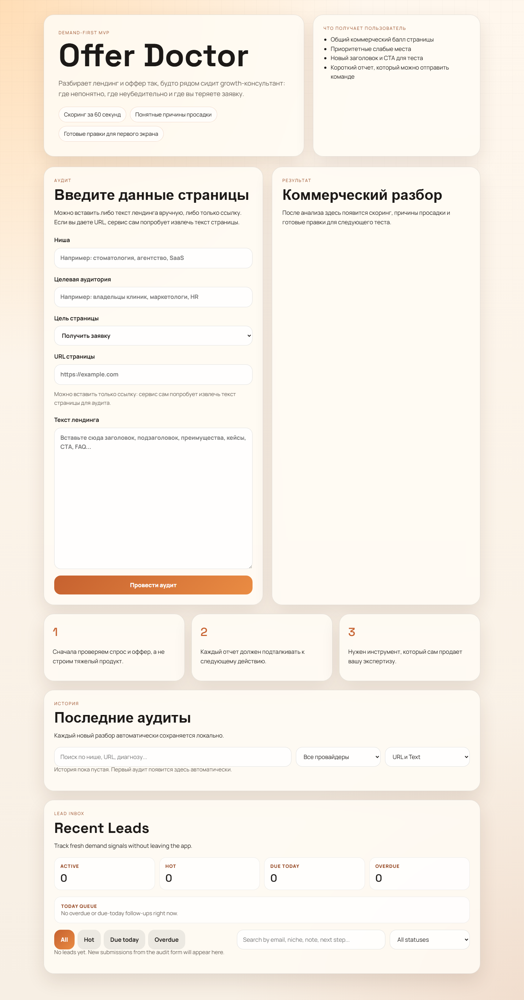

# Offer Doctor

Offer Doctor is a demand-first MVP tool that audits landing-page copy, scores the commercial strength of the offer, and turns the result into a lead workflow.

It is built as a small Node.js application: a static frontend, a lightweight HTTP API, local JSON/JSONL storage, optional AI providers, and a heuristic fallback that works without external keys.



## Features

- Audit pasted landing-page copy or extract copy from a URL.
- Score the offer across clarity, pain, value, trust, CTA, and structure.
- Generate prioritized issues, next actions, and a first-screen rewrite.
- Save reports locally and reopen them from history.
- Capture leads, track status, notes, next steps, and follow-up dates.
- Export reports as Markdown or through browser print-to-PDF.
- Optional Gemini, OpenAI, and Telegram integrations.

## Tech Stack

- Node.js ESM HTTP server
- Browser frontend with plain HTML, CSS, and JavaScript
- Local file storage in `data/`
- Native `node:test` API test suite
- `dotenv` for local configuration

## Quick Start

```bash
npm install
cp .env.example .env
npm start
```

Open `http://127.0.0.1:4173`.

If no AI key is configured, the app uses the local heuristic audit mode.

## Configuration

Copy `.env.example` to `.env` and fill only the values you need.

```bash
PORT=4173
AI_PROVIDER=heuristic
```

Supported providers:

- `heuristic`: local fallback, no key required
- `gemini`: requires `GEMINI_API_KEY`
- `openai`: requires `OPENAI_API_KEY`

Optional Telegram lead notifications require `TELEGRAM_BOT_TOKEN` and `TELEGRAM_CHAT_ID`.

## Admin Endpoints

History and lead inbox endpoints are private in deployed/admin usage:

- `GET /api/reports`
- `GET /api/reports/:id`
- `PATCH /api/reports/:id`
- `DELETE /api/reports/:id`
- `GET /api/leads`
- `PATCH /api/leads/:id`

Set `ADMIN_TOKEN` in `.env` to require:

```http
Authorization: Bearer <ADMIN_TOKEN>
```

When `ADMIN_TOKEN` is not set, these endpoints stay open for local MVP convenience.

Public endpoints remain open:

- `POST /api/analyze`
- `POST /api/leads`
- Static frontend files

## Security Notes

The server includes protections for the main MVP risks:

- strict report ID validation to block path traversal;
- JSON request body size limits;
- SSRF checks for URL extraction, including private IP ranges and IPv4-mapped IPv6;
- admin-token protection for report and lead management endpoints;
- lead source URL sanitization before links are returned to the frontend.

Never commit `.env`, `data/`, local notes, or generated reports. Rotate any credentials that were ever pasted into chat, logs, screenshots, or shared folders.

## Testing

```bash
npm test
node --check server.js
node --check app.js
node --check audit-core.js
npm audit --audit-level=moderate
```

The test suite uses an isolated temporary data directory and does not require real Gemini, OpenAI, or Telegram keys.

Covered smoke checks include:

- path traversal blocking for report endpoints;
- invalid and oversized JSON handling;
- internal URL / SSRF blocking;
- deterministic URL extraction happy path;
- admin token behavior;
- lead source URL sanitization;
- report history ordering with malformed JSON ignored.

## Portfolio Case Study

### Problem

Many AI-built MVPs fail because the product is built before the offer is proven. Founders and small teams often ship landing pages with vague positioning, weak proof, and unclear CTAs, then keep adding product features instead of fixing demand.

### Solution

Offer Doctor turns offer validation into a lightweight tool: paste landing-page copy or provide a URL, get a commercial score, see the highest-priority conversion issues, and save the result into a simple lead workflow.

### Architecture

- `server.js` owns the HTTP API, static serving, URL extraction, storage, AI provider calls, Telegram notifications, and admin endpoint protection.
- `audit-core.js` owns deterministic heuristic scoring and AI report normalization.
- `app.js` owns frontend state, rendering, export actions, history interactions, and lead inbox workflows.
- `data/` stores local reports and leads for MVP speed, while tests use an isolated temporary data directory.

### Security And Reliability Work

The project includes security hardening that is visible in the code and backed by tests:

- report ID validation blocks path traversal on read/update/delete endpoints;
- SSRF checks reject private, loopback, link-local, metadata, and IPv4-mapped IPv6 targets during URL extraction;
- request body limits protect API endpoints from unbounded JSON payloads;
- optional `ADMIN_TOKEN` protects private report and lead management endpoints;
- lead source URLs are sanitized before being rendered as links.

### Tradeoffs

Local file storage keeps the MVP easy to run and review, but it is not ideal for multi-instance deployments. A production version should move reports/leads to a database, add a small admin login flow, and separate public lead capture from private CRM views.

### What I Would Improve Next

- Add an admin-token UI or real login for the history and lead inbox panels.
- Replace local JSON storage with Postgres or SQLite for concurrent writes and querying.
- Unify all product UI copy into one language.
- Add screenshots or a short GIF of the full audit-to-lead flow.

## Project Structure

```text
.
├── app.js          # Frontend interactions and rendering
├── audit-core.js   # Heuristic scoring and AI report normalization
├── index.html      # Main UI
├── server.js       # HTTP API, static serving, integrations, storage
├── styles.css      # UI styling and print layout
├── test.js         # Native Node.js API/security smoke tests
└── data/           # Local runtime data, ignored by git
```

## Portfolio Demo Script

1. Start the app with `AI_PROVIDER=heuristic` for a no-key demo.
2. Paste landing-page copy or a safe public URL.
3. Run an audit and show the score, issues, actions, and rewrite.
4. Save a lead and open the lead inbox.
5. Run `npm test` to show the security/API smoke coverage.

## Deployment Notes

For a public deployment:

- set `ADMIN_TOKEN`;
- keep `.env` values in the hosting provider's secret manager;
- do not persist demo `data/` unless intentionally using local disk storage;
- consider replacing local file storage with a database if multiple users or instances are expected;
- add a small admin login/token UI before relying on the browser-based history and lead panels.
